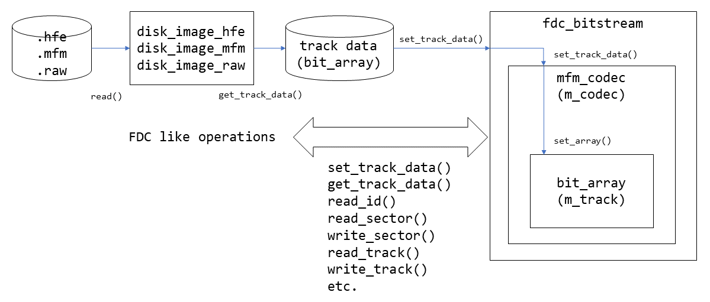
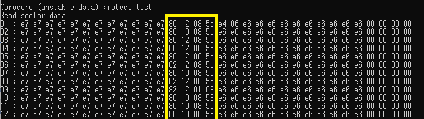

# C++ FDC library to manipulate 2D/MFM bitstream image data

## Description:  
This is a C++ library to provide FDC functions. 
Read and write functions mimic the actual operation of the Western Digital FD179x or Fujitsu MB8876 FDCs.
The FDC library is designed to be integrated with the old PC emulator programs.  

This FDC library can handle raw FDD output read data before the C/D separation is applied.  
The FDC library includes a data separator and simple VFO emulation features thus, the FDC can reproduce some copy protection data, which requires precise sub-bitrate data pulse timing.  

**This library directly reads and writes the bit stream data, so the track bit stream data even after applying some write operations, is still compliant with actual floppy bit stream data.**  

### Supported functions:
- Track read
- Track write
- ID read
- Sector read
- Sector write

### Supported floppy disk image formats:  
You can use `*.HFE` (for HxC floppy emulator), `*.MFM` (my original disk format), `*.RAW` (which can be generated by [floppy_disk_shield_2d](https://github.com/yas-sim/floppy_disk_shield_2d)), and `*.D77` (or D88. Originally, developed for a PC-8801 emulator). The specification of the `MFM` and `RAW` formats was defined by myself. These format can preserve precise sub-bitrate pulse data. By default, these file formats will capture the FDD RD data at the sampling rate of 4MHz.  

## API Document  
The API document generated by Doxygen can be found at `./docs/html` directory.  Please open [`./docs/html/index.html`](./docs/html/index.html) with a browser.   
*Note:* You can't open the HTML document from GitHub. Please clone the project and open the document locally.  

## How to integrate the fdc_bitstream library with your program
1. Required files  
	- Source codes: All C++ source codes are stored in the `./fdc_bitstream`. 
	- Header files: All C++ header files are stored in the `./includes` directory.
**Note:** The source codes of C++ classes for disk image handling/manipulation are in the `./disk_image` directory, but those codes are not mandatory to run `fdc_bitstream`.  
2. Classes
- Use the `fdc_bitstream` object to access the track data.  
	- `fdc_bitstream` takes track data in a `bit_array` object and performs read and write operations.  
	 -`fdc_bitstream` doesn't provide *seek* and *restore* functions. It simply provides read and write functions for the track data provided. The user program must handle *seek* and *restore* equivalent operations.  
- Track data is held in the `bit_array` object.  
	- You can access the data with *bit address* with `bit_array` object.  
	- `bit_array` object has an internal access pointer and provides streaming access. You can read and write bit data sequentially with the streaming functions.   
 	- You can choose two modes when you access by the streaming functions. One is ring-buffer mode, and the other one is elastic buffer mode.  
 	- In ring-buffer mode, you can access the bit data with the auto-increment pointer, and the pointer will go back to the top when it reaches the end of the buffer.    
 	- In elastic buffer mode, the buffer will automatically extend as you write over the end of the buffer.  
 - Use one of the `disk_image_???` class to read the disk image file. Supported formats are `HFE`, `MFM`, `RAW`, and `D77` (`MFM` and `RAW` are my original format. It is not compatible any other existing disk formats which shares the same file extension).  
3. Software VFO  
- [VFO](https://en.wikipedia.org/wiki/Variable-frequency_oscillator) is an oscillator that can change its oscillation frequency and is used in the floppy disk drives to follow the bit rate variation of the recorded data on the floppy disks.  
- It is one of the key component for accurate and reliable data reading.  
- This FDC library has software VFO to read the bit stream data. The SW-VFO is still the key component for reliable data reading.  
- You can modify or create your own VFO algorithm for better reading quality by implementing a new VFO class based on the `vfo_base` class.  




---

## (Simple) Multi format converter  
This project also includes a *simple* disk image converter that takes one of  `*.HFE`, `*.RAW`, `*.MFM`, or `*.D77` disk image data and convert it into either one of `*.MFM` or `*.D77` disk image data.  
- How to run:
```sh
image_converter -i input_file.[hfe|raw|mfm|d77] -o output_file.[mfm|d77] [-n] [-vfo vfo_type] [-gain low high] [-v]
```  
*Options:*  
|Option||Description|
|-|-|-|
|`-i`|`filename`|Input file name|
|`-o`|`filename`|Output file name|
|`-n`||Pulse pitch normalization.|  
|`-vfo`|`vfo_type`|Specify the type of VFO to be used to decode MFM bit stream for D77 output.<br>0:vfo_simple, 1:vfo_fixed, 2:vfo_pid, 3:vfo_pid2, 9:vfo_experimental|  
|`-gain`|`low` `high`|Set VFO gain (D77 only). e.g. `-gain 1.0 2.0`|
|`-v`||Verbose mode|

## Kryoflux RAW to MFM format converter  
`kfx2mfm.py` is a Python script to convert the disk images captured by [Kryoflux device](https://kryoflux.com/).  
Kryoflux can capture the disk image at a sampling rate of 24MHz, so it can preserve the disk pulse information precisely at a high resolution.  
- How to run:
```sh
python kfx2mfm.py -i <kfx raw image directory>
```  


---

## Directory structure - Libraries 
|Directory|Description|  
|---|---|  
|[`fdc_bitstream`](./fdc_bitstream/)|C++ FDC library source code|  
|[`disk_image`](./disk_image/)|C++ soure files to read/write/manipulate disk image files (MFM/D77/RAW/HFE).|
|`include`|C++ header files for the FDC library|  

## Directory structure - Sample/Test/Tool programs, etc  
|Directory|Description|  
|---|---|  
|`docs/html`|FDC library API document (`index.html`)|  
|[`fdc_test`](./fdc_test/)|FDC lib test program source code. You can learn how to use `bit_stream` and `image_???` classes.|  
|[`image_converter`](./image_converter/)|(MFM/D77/RAW/HFE) to (MFM/D77) disk image converter. The converter will take one of mfm/raw/hfe/d77 image file, translate it into a MFM data internally, and then output the data as either one of mfm/d77.|
|[`create_mfm_image`](./create_mfm_image/)|Creates an 2D/MFM disk image with regular format (ECMA/ISO).The program will create `new_image.mfm`.|  
|[`kfx2mfm`](./kfx2mfm/)|Kryoflux `RAW` files to `MFM` disk image file converter. Kryoflux `RAW` image consists of multiple `RAW` files. Each file contains bitstream data of a track captured at the clock rate of 24MHz.|  
|[`disk_analyzer`](./disk_analyzer/)|Simple disk image analyze tool. You can try VFO gain and fluctuator setting. This tool can visualize how VFO behaves (VFO visualizer) and check the pulse timing distribution of the disk image (histogram).|

## How to build the test program and tools

Build tested on Windows 11 (MSVC), and Linux (Ubuntu20, gcc).  
```sh
mkdir build
cd build
cmake ..
cmake --build .
```

----

## *Intentional* fluctuation mechanism - for timing sensitive copy-protection data reproduction

The actual floppy drive has a lot of elements that may introduce read data instability, such as spindle motor speed fluctuation, and bit pulse discontinuity by writing new data. Some copy-protect techniques intentionally cause those unstable read data at the desired point, and check whether the floppy disk is a genuine one or not by reading the unstable points several times. Most floppy image format preserves decoded MFM data, and it is impossible to reproduce this kind of copy-protect data because the data in the image is deterministic, and no timing variation happens. To reproduce such timing-dependent copy-protection data, the MFM and RAW disk image format capture the floppy drive read data at the x8 sampling rate (4MHz) of the 2D/MFM FDC bit rate (500KHz). The MFM and RAW format can preserve even irregular pulses, and therefore it can reproduce timing-sensitive copy-protection data.  

**To reproduce this kind of non-deterministic result, the FDC, `fdc_bitstream` should have some uncertainty in its operation.**  
If `fdc_bitstream` operates exactly the same everytime, the read result will be deterministic even if the floppy image contains some irregular pulses. `fdc_bitstream` has a `fluctuator` in the VFO in the data-separator.   
In the actual floppy drive, the VFO will automatically adjust the read timing to read the data accurately. Thanks to the VFO, the floppy drives can read the data accurately even if the bit pulse speed fluctuates. However, the tracking speed of the VFO is limited. It may get unsynchronized when the bit stream has timing discontinuity, or there are irregular pulses. Once the VFO gets unsynchronized, it requires a certain time to get synchronized again, and the read data will be indeterministic during this period.  

You can set the VFO fluctuation rate by using `fdc_bitstream::enable_fluctuator()` function. If you set `enable_fluctuator(1,4)`, the VFO operates at 3/4 and stops operation at the rate of 1/4. The operation is determined by a random generator, so the operation of the VFO will be stochastic, and the read data might be indeterministic if there are some irregular bits exiting in the bit stream.  Even if you apply the fluctuator, the read data will be deterministic unless there are irregular pulses.   
The `test4()` in the `fdc_test` generates random irregular pulses at a specific region in the track data and reads the sector data multiple times with the fluctuator enabled to check whether the stochastic fluctuator works as intended.  



----

## Command line examples for sample programs and tools.  

```sh
CMD> create_mfm_image
# 'new_image.mfm' will be created.
=== 0
=== 1
=== 2
 :  :
=== 83

CMD> image_converter -i new_image.mfm -o new_image.d77
# new_image.d77 will be created from new_image.mfm

new_image.mfm -> new_image.d77

```

----
## MFM image data format:
The default sampling rate for the MFM format is 4MHz. The data rate of the 2D/MFM format disk is 500KHz. This means, one bit cell will be recorded with eight bits of data in the MFM format.  

`|00001000|00000000|00100000|00010000|00000000| => 0x08,0x00,0x20,0x10,0x00 in MFM format`

```C++
// Header (ofst(byte) = 0)
typedef struct mfm_header_ {
    uint8_t     id_str[8];                  //  "MFM_IMG "
    uint64_t    track_table_offset;         // 
    uint64_t    number_of_tracks;           //
    uint64_t    spindle_time_ns;            //  Time for 1 rotation (ns unit) 
    uint64_t    data_bit_rate;              //  Data bit rate (bit/sec)    MFM=500Kbit/sec = 500,000
    uint64_t    sampling_rate;              //  Sampling rate of the bit stream data     4MHz = 4,000,000
} mfm_header;

// Track offset table (ofst(byte) = header.track_table_offset)
typedef struct track_table_ {
    uint64_t    offset;                     // Offset to the track data (unit=byte, from the top of the file == absolute offset)
    uint64_t    length_bit;                 // Track data length (uint=bits, not bytes)
} mfm_track_table[number_of_tracks];

// Track data * 84
//   ofst(byte) = track_table[track#].offset
//   size(byte) = track_table[track#].length_bit/8 + (track_table[track#].length%8)?1:0)
```
