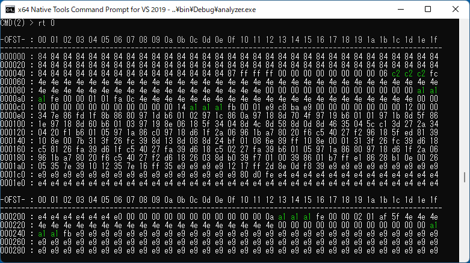
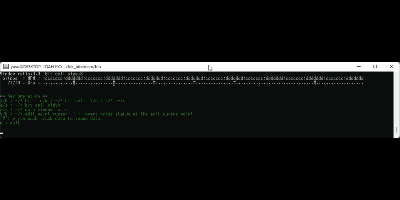
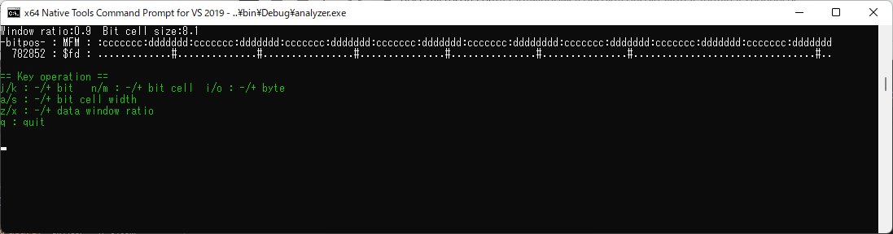
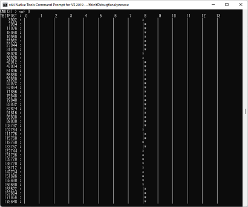

# Disk image analyzer tool  

|Command|Parameters|Description|
|-|-|-|
|`o`|`file_name`|Open an image file.(HFE/MFM/RAW/D77/FDX)|
|`w`|`file_name`|Write an image file. (MFM, D77, FDX)|
|`scr`|`file_name`|Run a script file.|
|`rt`|`trk`|Read track<br>The data in green color indicates that the data has '**missing-clock**' bit pattern.|
|`vt`|`trk` [`trk_e`]|Validate track(s).<br>Performs read ID and read sector for a track.<br>If you specify 'trk_e', the command will perform track validation from 'trk' to 'trk_e'.|
|`tt`|`trk` [`s_byte`] [`e_byte`]|Trim track.<br>Cut out the track data starting from 's_byte' to 'e_byte'.<br>The 's_byte' and 'e_byte' can be specified in byte position in the track dump.<br>If '`*`' is specified for 'trk', all tracks will be trimmed.<br>If '`*`' is specified for 's_byte' and 'e_byte' is omitted, the target track will be trimmed down to whole 1 disk rotation length based on the spindle time data (auto trimming). (e.g. `tt * *`)|
|`ri`|`trk` [`trk_e`]|Read all sector IDs.<br>Perform ID read from 'trk' to 'trk_e' if you specify 'trk_e'. Otherwise, an ID read operation will be performed for a track.|
|`rs`|`trk` `sct`|Read sector 1.<br>Read a sector from track=trk with CHR==(trk/2, trk%2, sct).|
|`rs`|`trk` `#sct`|Read sector 2.<br>Read a sector from track=trk with sector index #. The sector index # starts from 1 and #1 means the first sector after the index hole.<br>e.g. rs 0 #5 => The 5th sector in track 0.|
|`rsp`|`trk` `sct`|Read sector with pulse dump 1.<br>Perform a sector read and display the result with pulse dump. You can check the integrity of MFM pulses.|
|`rsp`|`trk` `#sct`|Read sector with pulse dump 2.<br>Same as `Read sector 2` but with pulse dump.|
|`ef`|`rate`|Enable fluctuator (VFO stops at rate of `rate(0.0-1.0)`|
|`ef`||Disable fluctuator|
|`gain`|`gl` `gh`|Set VFO gain (low=gl, high=gh)|
|`vfo`||Display current VFO parameters|
|`vv`|`trk` [`vfo_type`]|VFO visualizer.<br>Read data pulses from the top of a track using specified type of VFO.|
|`vpf`|`trk`|Visualize pulse fluctuation.<br>Visualize pulse pitch fluctuation throughout a track|
|`sv`|`vfo_type`|Select VFO type.|
|`vp`|`trk` `bit_pos`|Interactive pulse viewer.<br>You can check the condition of the raw bit stream data. You can change the bit position to show, bit cell width and bit window ratio by key operations. This feature supports MFM decoding, so you can check the real-time MFM decoded value of the bit stream you are seeing. Also, this feature will tell you the data matches the special missing clock pattern by showing the data in yellow.|
|`rv`||(soft) reset VFO<br>Initializes VFO parameters.|
|`histogram`|`trk`|Display histogram of data pulse distances in a track|
|`q`||Quit analyzer|
* Note1: The number starting with '$' will be handled as hexadecimal value (e.g. **$f7** == **247**)  
* Note2: **VFO type** = 0:vfo_fixed, 1:vfo_simple, 2:vfo_pid, 3:vfo_pid2, 9=experimental.  

## Command option  
The `analyzer` command will run a script file when the command is followed by a file name.  
```sh
analyzer script.txt
```


## Example  
```sh
>analyzer
*** Command list
o  file_name    Open an image file.
rt trk          Read track
ri trk          Read all sector IDs
rs trk sid sct  Read sector
ef nume denom   Enable fluctuator (VFO stops at rate of nume/denom)
ef              Disable fluctuator
gain gl gh      Set VFO gain (low=gl, high=gh)

CMD(1) > o disk.raw
Track num     : 80
Spindle speed : 199.698 [ms/rotation]
Sampling rate : 4 [Msamples/sec]
Data bit rate : 500 [Kbit/sec]
-- vfo_base --
Cell_size : 8
Cell_size_ref : 8
Window ratio  : 0.9
Window size   : 7.2
Windoe offset : 0.4
Gain (Low)    : 1
Gain (High)   : 2
Current gain  : 1
-- vfo_simple2 --
CMD(2) > ri 0
Read ID (0)
 1 00 00 01 01 fa0c ID-CRC_OK
 2 00 00 02 01 af5f ID-CRC_OK
 3 00 00 03 01 9c6e ID-CRC_OK
 4 00 00 04 01 05f9 ID-CRC_OK
 5 00 00 05 01 36c8 ID-CRC_OK
 6 00 00 06 01 639b ID-CRC_OK
 7 00 00 07 01 50aa ID-CRC_OK
 8 00 00 08 01 4094 ID-CRC_OK
 9 00 00 09 01 73a5 ID-CRC_OK
10 00 00 0a 01 26f6 ID-CRC_OK
11 00 00 0b 01 15c7 ID-CRC_OK
12 00 00 0c 01 8c50 ID-CRC_OK
13 00 00 0d 01 bf61 ID-CRC_OK
14 00 00 0e 01 ea32 ID-CRC_OK
15 00 00 0f 01 d903 ID-CRC_OK
16 00 00 10 01 ca4e ID-CRC_OK
CMD(3) > rs 0 1
Sector read : 0, 1

-OFST- : 00 01 02 03 04 05 06 07 08 09 0a 0b 0c 0d 0e 0f
---------------------------------------------------------
000000 : 00 01 e9 c8 ba e9 00 00 00 00 00 00 00 12 00 00
000010 : 34 7e 86 fd 1f 8b 86 80 97 1d b6 01 02 97 1c 86
000020 : 0a 97 18 8d 70 4f 97 19 b6 01 01 97 1b 8d 5f 86
000030 : 1e 97 18 8d 60 b6 01 03 97 19 8e 06 18 5f 34 04
000040 : 8d 4c 8d 58 8d 0d 8d 46 35 04 5c c1 3d 27 2a 34
000050 : 04 20 f1 b6 01 05 97 1a 86 c0 97 18 d6 1f 2a 06
000060 : 96 1b a7 80 20 f6 c5 40 27 f2 96 18 5f ed 81 39
000070 : 10 8e 00 7b 31 3f 26 fc 39 8d 13 8d 08 8d 24 bf
000080 : 01 08 6e 89 ff 10 8e 00 01 31 3f 26 fc 39 d6 18
000090 : c5 81 26 fa 39 d6 1f c5 40 27 fa 39 d6 18 c5 02
0000a0 : 27 fa 39 b6 01 05 97 1a 86 80 97 18 d6 1f 2a 06
0000b0 : 96 1b a7 80 20 f6 c5 40 27 f2 d6 18 26 03 8d b0
0000c0 : 39 f7 01 00 39 86 01 b7 ff e1 86 28 b1 0e 00 26
0000d0 : 05 35 7e 39 10 12 35 7e 16 ff 35 e9 e9 e9 e9 12
0000e0 : 17 ff 2d 8e 0d f8 39 e9 e9 e9 e9 e9 e9 e9 e9 e9
0000f0 : e9 e9 e9 e9 e9 e9 e9 e9 e9 e9 e9 e9 e9 e9 e9 e9

CRC DAM  RNF ----ID_POS ---DAM_POS ---END_POS ---TIME(ms) SIZE
OK  DAM  OK       20619      26431      59630    9.75275 256
CMD(4) > rt 0

-OFST- : 00 01 02 03 04 05 06 07 08 09 0a 0b 0c 0d 0e 0f 10 11 12 13 14 15 16 17 18 19 1a 1b 1c 1d 1e 1f
---------------------------------------------------------------------------------------------------------
000000 : b9 39 39 39 39 39 39 39 39 39 39 39 39 39 39 39 39 39 39 39 39 39 39 39 39 39 39 39 39 39 39 39
000020 : 39 39 39 39 39 39 39 39 39 39 39 39 39 39 39 39 39 39 39 39 39 39 39 39 39 39 39 39 39 39 39 39
000040 : 39 39 39 39 39 39 39 39 39 39 39 39 39 39 39 38 00 00 00 00 00 00 00 00 00 00 00 03 c2 c2 c2 fc
000060 : 4e 4e 4e 4e 4e 4e 4e 4e 4e 4e 4e 4e 4e 4e 4e 4e 4e 4e 4e 4e 4e 4e 4e 4e 4e 4e 4e 4e 4e 4e 4e 4e
000080 : 4e 4e 4e 4e 4e 4e 4e 4e 4e 4e 4e 4e 4e 4e 4e 4e 4e 4e 00 00 00 00 00 00 00 00 00 00 00 00 a1 a1
0000a0 : a1 fe 00 00 01 01 fa 0c 4e 4e 4e 4e 4e 4e 4e 4e 4e 4e 4e 4e 4e 4e 4e 4e 4e 4e 4e 4e 4e 4e 00 00
0000c0 : 00 00 00 00 00 00 00 00 00 00 00 14 a1 a1 a1 fb 00 01 e9 c8 ba e9 00 00 00 00 00 00 00 12 00 00
0000e0 : 34 7e 86 fd 1f 8b 86 80 97 1d b6 01 02 97 1c 86 0a 97 18 8d 70 4f 97 19 b6 01 01 97 1b 8d 5f 86
000100 : 1e 97 18 8d 60 b6 01 03 97 19 8e 06 18 5f 34 04 8d 4c 8d 58 8d 0d 8d 46 35 04 5c c1 3d 27 2a 34
000120 : 04 20 f1 b6 01 05 97 1a 86 c0 97 18 d6 1f 2a 06 96 1b a7 80 20 f6 c5 40 27 f2 96 18 5f ed 81 39
000140 : 10 8e 00 7b 31 3f 26 fc 39 8d 13 8d 08 8d 24 bf 01 08 6e 89 ff 10 8e 00 01 31 3f 26 fc 39 d6 18
000160 : c5 81 26 fa 39 d6 1f c5 40 27 fa 39 d6 18 c5 02 27 fa 39 b6 01 05 97 1a 86 80 97 18 d6 1f 2a 06
000180 : 96 1b a7 80 20 f6 c5 40 27 f2 d6 18 26 03 8d b0 39 f7 01 00 39 86 01 b7 ff e1 86 28 b1 0e 00 26
0001a0 : 05 35 7e 39 10 12 35 7e 16 ff 35 e9 e9 e9 e9 12 17 ff 2d 8e 0d f8 39 e9 e9 e9 e9 e9 e9 e9 e9 e9
0001c0 : e9 e9 e9 e9 e9 e9 e9 e9 e9 e9 e9 e9 e9 e9 e9 e9 80 d0 fe e4 e4 e4 e4 e4 e4 e4 e4 e4 e4 e4 e4 e4
0001e0 : e4 e4 e4 e4 e4 e4 e4 e4 e4 e4 e4 e4 e4 e4 e4 e4 e4 e4 e4 e4 e4 e4 e4 e4 e4 e4 e4 e4 e4 e4 e4 e4

-OFST- : 00 01 02 03 04 05 06 07 08 09 0a 0b 0c 0d 0e 0f 10 11 12 13 14 15 16 17 18 19 1a 1b 1c 1d 1e 1f
---------------------------------------------------------------------------------------------------------
000200 : e4 e4 e4 e4 e4 e4 e0 00 00 00 00 00 00 00 00 00 00 00 0a a1 a1 a1 fe 00 00 02 01 af 5f 4e 4e 4e
000220 : 4e 4e 4e 4e 4e 4e 4e 4e 4e 4e 4e 4e 4e 4e 4e 4e 4e 4e 4e 00 00 00 00 00 00 00 00 00 00 00 00 a1
  :                 :                 :                   :                   :                 :
CMD(5) > vt 0

Track 0
  #: CC HH RR NN --- ID CRC ---  SIZE
  1: 00 00 01 01 fa0c ID-CRC_OK   256 DAM  DT-CRC OK  RNF_OK  IDAM_POS=   20619 DAM_POS=   26431
  2: 00 00 02 01 af5f ID-CRC_OK   256 DAM  DT-CRC OK  RNF_OK  IDAM_POS=   68278 DAM_POS=   73917
  3: 00 00 03 01 9c6e ID-CRC_OK   256 DAM  DT-CRC OK  RNF_OK  IDAM_POS=  115946 DAM_POS=  121579
  4: 00 00 04 01 05f9 ID-CRC_OK   256 DAM  DT-CRC OK  RNF_OK  IDAM_POS=  163526 DAM_POS=  169160
  5: 00 00 05 01 36c8 ID-CRC_OK   256 DAM  DT-CRC OK  RNF_OK  IDAM_POS=  211097 DAM_POS=  216727
  6: 00 00 06 01 639b ID-CRC_OK   256 DAM  DT-CRC OK  RNF_OK  IDAM_POS=  258703 DAM_POS=  264337
  7: 00 00 07 01 50aa ID-CRC_OK   256 DAM  DT-CRC OK  RNF_OK  IDAM_POS=  306179 DAM_POS=  311796
  8: 00 00 08 01 4094 ID-CRC_OK   256 DAM  DT-CRC OK  RNF_OK  IDAM_POS=  353669 DAM_POS=  359291
  9: 00 00 09 01 73a5 ID-CRC_OK   256 DAM  DT-CRC OK  RNF_OK  IDAM_POS=  401205 DAM_POS=  406815
 10: 00 00 0a 01 26f6 ID-CRC_OK   256 DAM  DT-CRC OK  RNF_OK  IDAM_POS=  448721 DAM_POS=  454345
 11: 00 00 0b 01 15c7 ID-CRC_OK   256 DAM  DT-CRC OK  RNF_OK  IDAM_POS=  496261 DAM_POS=  501888
 12: 00 00 0c 01 8c50 ID-CRC_OK   256 DAM  DT-CRC OK  RNF_OK  IDAM_POS=  543992 DAM_POS=  549641
 13: 00 00 0d 01 bf61 ID-CRC_OK   256 DAM  DT-CRC OK  RNF_OK  IDAM_POS=  591645 DAM_POS=  597277
 14: 00 00 0e 01 ea32 ID-CRC_OK   256 DAM  DT-CRC OK  RNF_OK  IDAM_POS=  639250 DAM_POS=  644907
 15: 00 00 0f 01 d903 ID-CRC_OK   256 DAM  DT-CRC OK  RNF_OK  IDAM_POS=  687021 DAM_POS=  692656
 16: 00 00 10 01 ca4e ID-CRC_OK   256 DAM  DT-CRC OK  RNF_OK  IDAM_POS=  734632 DAM_POS=  740285

```

* Track dump  
Track dump can indicate the missing-clock* bytes with green color.   


* Histogram  
	* Shows distribution of the pulse-to-pulse distance in a track.  
  * You can check the image quality. The more clear separation of pulse distribution, the better quality.  
  * Also, you can check the **actual** bit rate of the pulses. The actual bit rate can vary due to spindle motor speed fluctuation or incorrect spindle motor speed calibration.  

```sh
CMD(5) > histogram 0
#clocks  #pulses
   0 :        0 :
   1 :        3 :
   2 :        1 :
   3 :        1 :
   4 :        0 :
   5 :        0 :
   6 :        0 :
   7 :        0 :
   8 :        1 :
   9 :        2 :
  10 :        3 :
  11 :        2 :
  12 :        2 :
  13 :        4 :
  14 :        0 :
  15 :      236 : *
  16 :    14395 : ****************************************************************************************************
  17 :    10734 : **************************************************************************
  18 :      192 : *
  19 :        4 :
  20 :        1 :
  21 :        2 :
  22 :       21 :
  23 :     1668 : ***********
  24 :     6770 : ***********************************************
  25 :     3705 : *************************
  26 :      208 : *
  27 :        0 :
  28 :        2 :
  29 :        0 :
  30 :        2 :
  31 :      228 : *
  32 :     1378 : *********
  33 :      692 : ****
  34 :       22 :
  35 :        0 :
  36 :        0 :
  37 :        0 :
  38 :        0 :
  39 :        3 :
  40 :        1 :
  41 :        0 :

Peaks:
1 : 16 [CLKs]
2 : 24 [CLKs]
3 : 32 [CLKs]

Estimated bit cell width : 8 [CLKs] (CLK=4 MHz)
Data bit rate : 500 [Kbits/sec]
```
* VFO Visualizer
	* Visualises the operation of software VFO.   
  * You can try different type of VFOs with `sv` command.  

|Symbol|Meaning|
|--|--|
|`>`, `<`|Bit cell width.|
|`-`|Data window period. The data pulse must be in this period. The data window width should be 50% of the bit cell width in MFM/2D standard, but this library uses 75% for easy data reading. You can tweak the data window ratio with an API. |  
|`P`|Data pulse|

```sh
CMD(6) > vv 0
     0 >P     -------------------------------------       <
     1 > P    -------------------------------------      <
     2 >  P   -------------------------------------      <
     3 >    P -------------------------------------      <
     4 >      ------P-----------------------------       <
     5 >      ----------P-------------------------      <
     6 >      --------------P---------------------      <
     7 >      -----------------P------------------      <
     8 >      ---------------------P--------------      <
     9 >      -----------------------P------------      <
    10 >      --------------------------------P---      <
    11 >      ----------------------------------P-       <
    12 >      ------------------------------------P      <
    13 >      ------------------------------------- P    <
    14 >      -------------------------------------  P   <
    15 >      -------------------------------------  P   <
    16 > P    -------------------------------------       <
    17 >  P   -------------------------------------      <
    18 >    P -------------------------------------      <
    19 >      P------------------------------------      <
    20 >      ---P---------------------------------      <
    21 >      -----P------------------------------       <
    22 >      --------------P---------------------      <
    23 >      ------------------P-----------------      <
    24 >      ---------------------P--------------      <
    25 >      -------------------------P----------      <
    26 >      ----------------------------P-------      <
    27 >      ------------------------------P-----       <
    28 >      -------------------------------------P     <
    29 >      -------------------------------------  P   <
     :                          :                        :
  4977 >      ---------------------P----------------       <
  4978 >      -------------------P------------------       <
  4979 >      ----------------------P---------------       <
  4980 >      --------------------P-----------------       <
  4981 >      ------------------P-------------------       <
  4982 >      ---------------P----------------------       <
  4983 >      -------------------P------------------       <
  4984 >      -----------------P--------------------       <
  4985 >      ---------------------P----------------       <
  4986 >      -------------------P------------------       <
  4987 >      ----------------------P---------------       <
  4988 >      -------------------P------------------       <
  4989 >      ----------------------P---------------       <
  4990 >      -------------------P------------------       <
  4991 >      -----------------------P--------------       <
  4992 >      --------------------P-----------------       <
  4993 >      ------------------------P-------------       <
  4994 >      -------------------P------------------       <
  4995 >      -----------------------P--------------       <
  4996 >      --------------------P-----------------       <
  4997 >      -----------------------P--------------       <
  4998 >      -------------------P------------------       <
  4999 >      ----------------------P---------------       <
-- vfo_base --
Cell_size : 8.22547
Cell_size_ref : 8
Window ratio  : 0.75
Window size   : 6.1691
Windoe offset : 1.02818
Gain (Low)    : 1
Gain (High)   : 2
Current gain  : 1
-- vfo_simple --
Freq integral  : -2.25465
CMD(7) > q
```

### Interactive Pulse Viewer ('vp' command)  

You can view and check the bit stream data at an arbitrary point.  The viewer has a simple MFM decoding feature so that you can check the decoded value in real-time.  
You can move the display point by sampling unit, bit cell unit, or byte unit by key operation.  
This viewer also has a simple pulse edit feature. You can add or remove the pulses at any point.  



### Pulse pitch fluctuation viewer ('vpf' command)  

You can check the fluctuation of pulse pitch in a track. FDD/FDC is expecting stable pulse pitches to decode MFM data. However, some floppy disk mediums may have pulse pitch fluctuation, making the disk image data reconstruction from the captured data difficult.    
This feature visualizes the pulse pitch fluctuation through a track so that you can visually check the stability of the pulses in the medium.   

* Bad case - pulse pitch is fluctuating  

* Good case - stable and regular pulse pitch   

